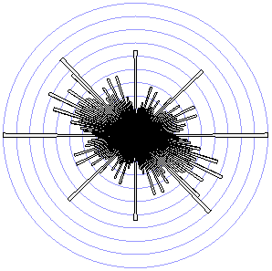
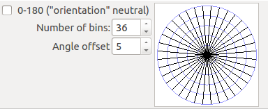
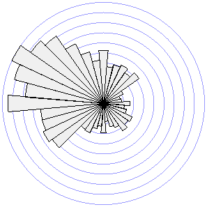

.. linedirectionhistogram documentation master file, created by
   sphinx-quickstart on Sun Feb 12 17:11:03 2015.

*******************************************
The QGIS Line Direction Histogram Plugin
*******************************************

.. toctree::
   :maxdepth: 2

.. |rose| image:: illustrations/rosediagram.png
   :width: 200
   :align: middle

|rose|
   
Functionality
=================

- The QGIS Line Direction Histogram Plugin creates a rose diagram
  that can be used to investigate the distribution of the directions
  of line segments of a line or polygon vector dataset.

- The accumulated lengths of the line segments for each direction bin
  determines the shape of the histogram.
  Alternatively, the number of segments can be used (no weighting on
  line segment length).

- Line and Polygon vector layers are supported, including
  multigeometries.

- Feature selections are supported.

- The number of direction bins for the histogram can be specified.

  +---------------+----------------+
  | Fewer bins    | More bins      |
  +===============+================+
  | |rose|        | |rose90_1|     |
  +---------------+----------------+

- All the direction bin sectors will have the same size (same number
  of degrees covered).  This type of angle histogram is also called
  a "rose diagram" or "rose plot".

- An angle offset (positive or negative - clockwise or counter
  clockwise) for the direction bins can be specified.

- The positions of the direction bins are shown graphically.

  +------------------------------------------+
  | Direction bins illustration and options  |
  +==========================================+
  | |specbins|                               |
  +------------------------------------------+

- The user can choose if the histograms shall be "orientation"
  neutral (0-180 degrees instead of 0-360 degrees).

  +----------------------+---------------------------------------------------------+
  | Orientation neutral  | Not orientation neutral (with twice the number of bins) |
  +======================+=========================================================+
  | |rose|               | |rose36_5_360|                                          |
  +----------------------+---------------------------------------------------------+

- A direction histogram (or rose diagram) is displayed, showing the
  distribution of the directions according to the chosen bins.
  
- The histogram can be saved to a CSV file.

- The histogram can be saved as PDF (100 mm by 100 mm) and SVG
  (200 by 200). -- added in version 1.3

- The histogram can be copied to the clipboard. -- added in version
  1.4
  
- If the plugin window is resized, the direction histogram is also
  resized.

Tiling
------
Added in version 2.0.

There is an option available for producing at point layer styled
using rose diagrams (using SVG files) according to a tiling
specified using a polygon layer.

  .. |tiling| image:: illustrations/tiling.png
   :align: middle

|tiling|

- The polygon layer can be chosen

- The location for storing the SVG files can be specified

- The SVG files are not deleted - the default location is the
  system temporary file directory

All the other options are also respected when generating the
rose diagrams for the tiles.

Due to a QGIS issue with SVG file caching (#13565: "modifying a
svg already cached doesn't invalidate the cache, renders as
version initially loaded during a session"), the SVG files have
to be stored using unique file names.
This produces a lot of SVG files that are not deleted by the plugin.

Direction mean
--------------
Added in version 2.4.

An indication of the direction mean (direction and strength) can be
added to the rose diagrams.

  .. |dirmeannon| image:: illustrations/rosedirmeannonneutral.png
   :width: 200
   :align: middle

  .. |dirmeanlow| image:: illustrations/rosedirmeanneutrallow.png
   :width: 200
   :align: middle

  .. |dirmeanhigh| image:: illustrations/rosedirmeanneutralhigh.png
   :width: 200
   :align: middle

  .. |dirmean| image:: illustrations/rosedirmeanneutral.png
   :width: 200
   :align: middle

+---------------+---------------+---------------+---------------+
| Direction mean                                                |
+---------------+---------------+---------------+---------------+
| Not           | Orientation neutral                           |
+---------------+---------------+---------------+---------------+
| or. neutral   | medium        | low           | high          |
+===============+===============+===============+===============+
| |dirmeannon|  | |dirmean|     | |dirmeanlow|  | |dirmeanhigh| |
+---------------+---------------+---------------+---------------+

The displayed histogram
========================

The displayed histogram is normalised, so that the maximum value of
the direction bins will result in a sector with a maximum length, and
the lengths of the sectors of the rest of the bins are scaled
proportionally.

The saved histogram (CSV)
=========================

The saved histogram is a CSV file with four columns:

- The first column ("StartAngle") contains the start angle of the
  direction bin.
- The second column ("EndAngle") contains the end angle of the
  direction bin.
- The third column ("Length") contains the accumulated lengths of
  the line segments that fall within the bin.
- The fourth column ("Number") contains the number of line segments
  that fall within the bin.

"." is used as the decimal separator in the CSV file.

The CSV file is accompanied by a CSVT file that describes the
data types of the CSV file columns.

Options
=============

- The user can specify if only selected features are to be used
  (but if no features are selected, all features will be used).
  This is the default if the layer has selected features.

- The user can specify the number of direction bins (the default
  is 8).

- The user can specify an angle offset (clockwise from north)
  for the direction bins (the default i 0).

- The user can choose to ignore the "orientation" of the lines.
  In that case, two lines with opposite  directions will end up in
  the same direction bin (this is the default).

- The user can specify an output CSV file for the (over all)
  histogram.

- The user can specify if line segment length shall be used for
  weighting the bins (this is the default).

- The user can choose to use the logarithm to define the radius of
  the sectors.
  The default is not to use the logarithm.

- The user can choose to have the area of a sector of the
  histogram be proportional to the accumulated amount for
  that sector.
  The default is that the length / radius of a sector is
  proportional to the accumulated amount (histogram like
  behaviour).

- The user can choose to produce a point layer styled with rose
  diagrams according to a tiling by a selected polygon layer.
  For this option, it is also possible to specify the location
  for storing the generated SVGs (that are used for styling the
  rose diagram layer.

- The user can specify that the direction mean shall be included in
  the rose diagram(s).

  For the orientated option, a line that shows the average direction
  vector is added.

  For the non-orientated option, the sector that has the highest
  mean direction value is given a background colour, with the amount
  of colour indicating the strength of direction trend (white for
  neutral, 100% colour if all line segments have a direction that
  belongs to this sector).
  For the non-oriented option, the sector bins are transparent.

Implementation
================

The calculations of the histogram is performed in a separate thread.
Each line geometry is traversed from start to end.
For each segment of the line, the angle and length are calculated.
The angle is used to determine which bin the segment falls into, and
the length is added to the accumulated length for the bin.

Polygons are split into its rings, and the line geometry of each ring
is used for the calculations.

Mean direction
-----------------

Non-orientation neutral
  The normalised mean direction vector
  (:math:`\boldsymbol{dist\_mean}`) is calculated from the bins
  (sectors).
  Each sector is represented by a vector
  (:math:`\boldsymbol{sector}`) with length equal to the total length
  of the line segments in the sector.
  The middle of the sector is used as the sector vector angle.
  The vector is normalised by dividing by the sum of the bin / sector
  line lengths.

  .. math::

     \boldsymbol{dist\_mean} = \frac{\sum_{i=1}^{n} \boldsymbol{sector_i}}{\sum_{i=1}^{n} {|\boldsymbol{sector_i}|}}
 
Orientation neutral
  For each bin / sector, a mean vector is calculated by considering
  only the bins / sectors that have a centre angle that is within 90°
  from the centre angle of that bin / sector.
  The sector with the maximum mean vector is chosen to represent the
  mean direction.
  The sector mean vector value (:math:`value`) is normalised by
  subtracting the value (:math:`even\_dist\_value`) that would result
  from an even distribution among the sectors and scaling the result
  to a [0..100] scale using the sum of the bin lengths
  (:math:`total\_sum`).

  .. math::

     normalised\_value = \frac{100 * (value - even\_dist\_value)}{(total\_sum - even\_dist\_value)}
  

Versions
===============
The current version is 2.0.

- 2.4 (not released)
    - User interface change from toolbox to tab for options
    - Added directional mean indicators to the rose diagrams
    - ...
- 2.3
    - Added the logarithm option (#17)
    - Fixed CSV output (#16)
- 2.2
    - Fixed angle offset issue (#15) and added some circular statistics output (#14)
- 2.1
    - Fixed issue #13 (problems with multipart geometries)
- 2.0
    - Added option to generate a point layer with rose diagrams based on tiles provided through a polygon layer (#10, #11)
    - Set the default state for "selected features only" based on the presence of a selection (#12)
- 1.6
    - Fixed progress bar issue (#9)
- 1.5
    - Added help button
- 1.4
    - Copy to clipboard button added (#8)
- 1.3
    - PDF and SVG export added
    - Area-proportional sectors option introduced
- 1.2
    - Fixed issue #1 (on update of min/max for angle offset)
    - Fixed issue #2 (divide by zero when no features in layer)
    - Fixed issue #3 (effect of "no weighting" checkbox)
- 1.1:
    - Selected features option introduced
    - Unweighted option introduced
    - Multigeometry support
    - CSV file header row added
    - CSV angle offset bug fixed
    - User interface fixes and updates
- 1.0: First official version.

Links
=======

`LineDirectionHistogram Plugin`_

`LineDirectionHistogram code repository`_

`LineDirectionHistogram issues`_

.. _LineDirectionHistogram code repository: https://github.com/havatv/qgislinedirectionhistogramplugin.git
.. _LineDirectionHistogram Plugin: https://plugins.qgis.org/plugins/LineDirectionHistogram/
.. _LineDirectionHistogram issues: https://github.com/havatv/qgislinedirectionhistogramplugin/issues
.. |N2| replace:: N\ :sup:`2`
